# Identificación de la posición de un cubo de Rubik considerando los colores

Proyecto desarrollado para el curso de **Procesamiento de Imágenes Digitales (PID)**. El sistema identifica la posición de un cubo de Rubik a partir de **dos imágenes RGB**, donde cada imagen muestra tres caras visibles. A partir de estas dos vistas, el algoritmo reconstruye las seis caras del cubo, clasifica los colores de los stickers y evalúa el resultado contra un archivo de verdad terreno (`ground_truth_cubo.csv`).

<p align="center">
  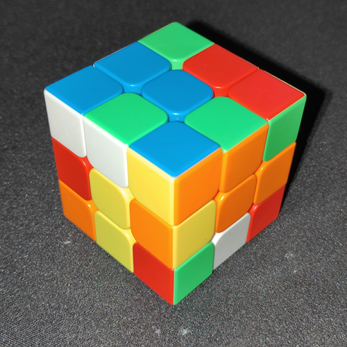
</p>

---

## 1. Tema del proyecto

**Identificación de la posición de un cubo de Rubik considerando los colores.**

El problema consiste en detectar automáticamente los stickers visibles de un cubo de Rubik, clasificarlos según su color y reconstruir la configuración completa del cubo usando dos fotografías complementarias. Cada caso del dataset contiene:

- `img1.png`: primera vista del cubo, con tres caras visibles.
- `img2.png`: segunda vista del cubo, con las otras caras necesarias para completar el cubo.
- `ground_truth_cubo.csv`: matriz esperada de las seis caras del cubo.

---

## 2. Objetivos

### Objetivo general

Desarrollar un pipeline de procesamiento de imágenes en MATLAB capaz de identificar la posición de un cubo de Rubik considerando los colores de sus stickers, usando dos imágenes por caso para reconstruir las seis caras del cubo.

### Objetivos específicos

1. Leer y analizar imágenes RGB del cubo en el espacio HSV.
2. Separar el cubo del fondo mediante segmentación y morfología matemática.
3. Estimar automáticamente las esquinas de las caras visibles usando Canny y Hough.
4. Rectificar geométricamente cada cara visible mediante transformación proyectiva.
5. Extraer 27 stickers por imagen mediante una grilla geométrica 3x3 por cara.
6. Clasificar los colores de los stickers usando características HSV/RGB y K-means.
7. Integrar las seis caras del cubo a partir del color central de cada cara.
8. Evaluar el desempeño mediante accuracy, métricas por color y matriz de confusión.
9. Validar el método en un dataset de múltiples casos aleatorios.

---

## 3. Estructura del proyecto

```text
Proyecto_PID_Rubik/
│
├── main_rubik.m
├── main_prueba_masiva.m
├── main_fase12_resultados.m
├── config_rubik.m
│
├── fases/
│   ├── fase1_analisis_hsv.m
│   ├── fase2_preprocesamiento.m
│   ├── fase3_roi_cubo.m
│   ├── fase4_segmentacion_stickers.m
│   ├── fase5_regionprops_kmeans.m
│   ├── fase6_agrupacion_caras.m
│   ├── fase7_matrices_caras.m
│   ├── fase8_integracion_cubo.m
│   ├── fase9_evaluacion_cubo.m
│   ├── fase10_reporte_final.m
│   ├── fase11_prueba_masiva.m
│   └── fase12_resultados_dataset.m
│
├── funciones/
│   └── obtener_poligonos_caras.m
│
├── dataset/
│   ├── caso_001/
│   │   ├── img1.png
│   │   ├── img2.png
│   │   └── ground_truth_cubo.csv
│   ├── caso_002/
│   └── ...
│
├── resultados/
│   ├── caso_001/
│   ├── caso_002/
│   └── prueba_masiva/
│
└── docs/
    └── img/
        ├── portada_cubo.png
        ├── pipeline_general.png
        ├── fase3_roi.png
        ├── fase5_candidatos.png
        ├── fase8_cubo_integrado.png
        ├── grafico_accuracy_por_caso.png
        ├── matriz_confusion_global.png
        └── metricas_globales_por_color.png
```

---

## 4. Pipeline metodológico

El pipeline completo se divide en doce fases. Las primeras diez fases procesan un caso individual, mientras que las fases 11 y 12 consolidan los resultados del dataset completo.

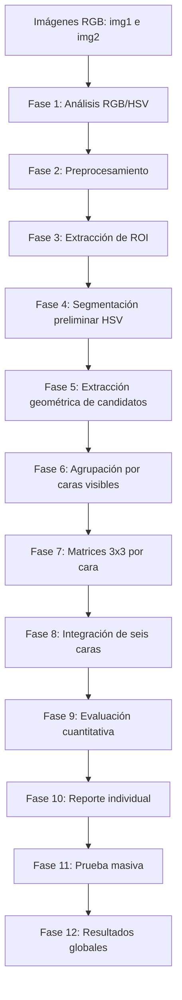

<p align="center">
  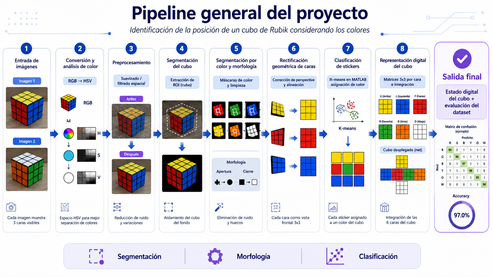
</p>

---

## 5. Descripción de las fases

### Fase 1: Análisis inicial RGB/HSV

Se leen las dos imágenes del caso y se convierten de RGB a HSV. Esta fase permite analizar tres componentes relevantes:

- **H**: tono del color.
- **S**: saturación, útil para diferenciar stickers coloreados de stickers blancos.
- **V**: brillo, útil para separar el cubo del fondo.

También se generan histogramas HSV para observar la distribución de colores e iluminación.

<p align="center">
  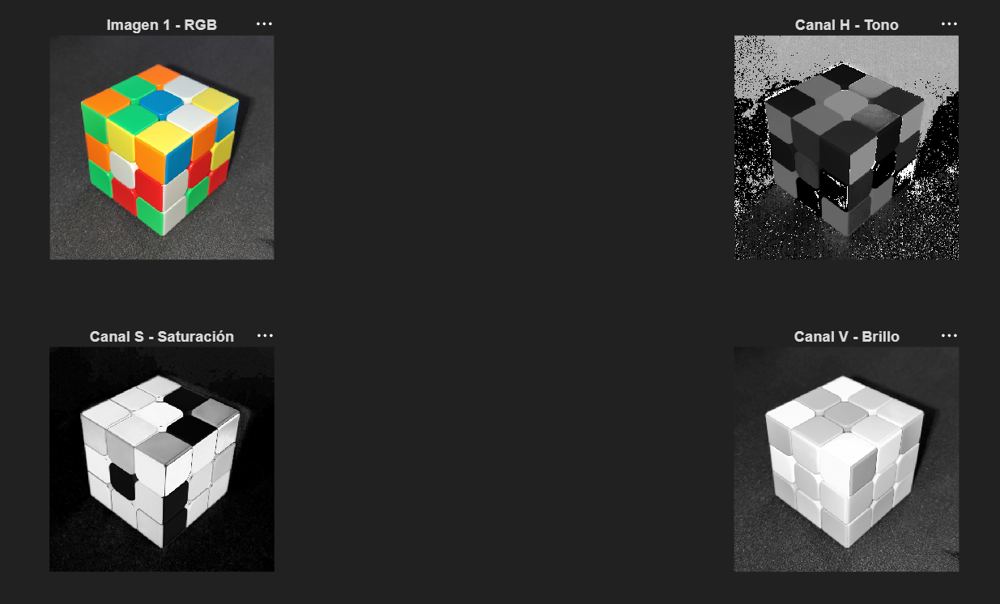
</p>

---

### Fase 2: Preprocesamiento

Se aplica suavizado para reducir ruido visual sin perder la estructura del cubo. Las técnicas aplicadas fueron:

- Conversión de imagen a tipo `double`.
- Filtro gaussiano sobre la imagen RGB.
- Filtro de mediana sobre el canal V.
- Ecualización adaptativa como análisis comparativo, no como base del pipeline principal.

El canal V suavizado se conserva para las fases posteriores.

<p align="center">
  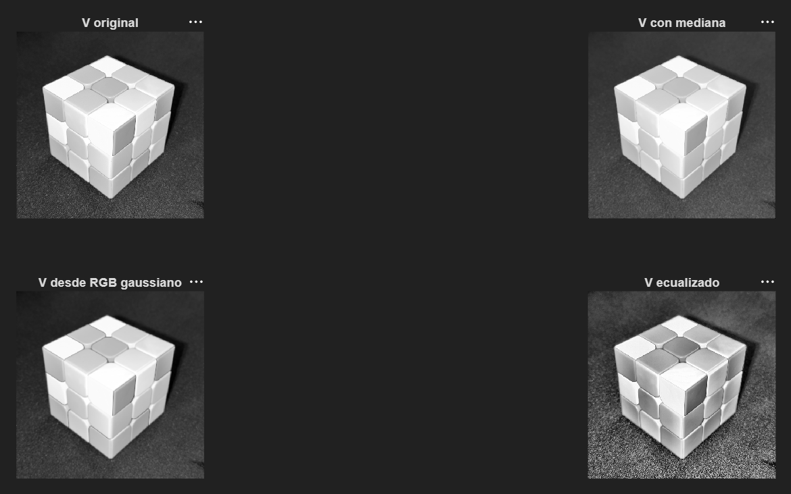
</p>

---

### Fase 3: Extracción de ROI del cubo

Se obtiene la región de interés del cubo separándolo del fondo. Para ello se usa una combinación de umbralización, operaciones morfológicas y análisis de componentes conectados.

Técnicas usadas:

- Umbralización del canal V.
- `bwareaopen` para eliminar ruido pequeño.
- Cierre morfológico (`imclose`) para compactar la silueta.
- Relleno de huecos (`imfill`).
- Selección del componente principal (`bwareafilt`).
- Cálculo del `BoundingBox` con `regionprops`.

<p align="center">
  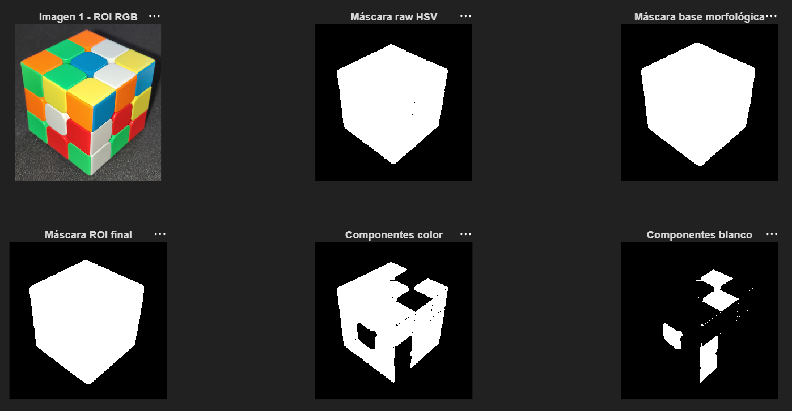
</p>

---

### Fase 4: Segmentación preliminar por color

Se generan máscaras aproximadas por color en el espacio HSV. Esta fase funciona como apoyo visual y diagnóstico, pero no es la única base de la clasificación final.

Técnicas usadas:

- Umbrales HSV para rojo, naranja, amarillo, verde, azul y blanco.
- Reglas de saturación y brillo para separar blanco de colores saturados.
- Limpieza morfológica de máscaras.

<p align="center">
  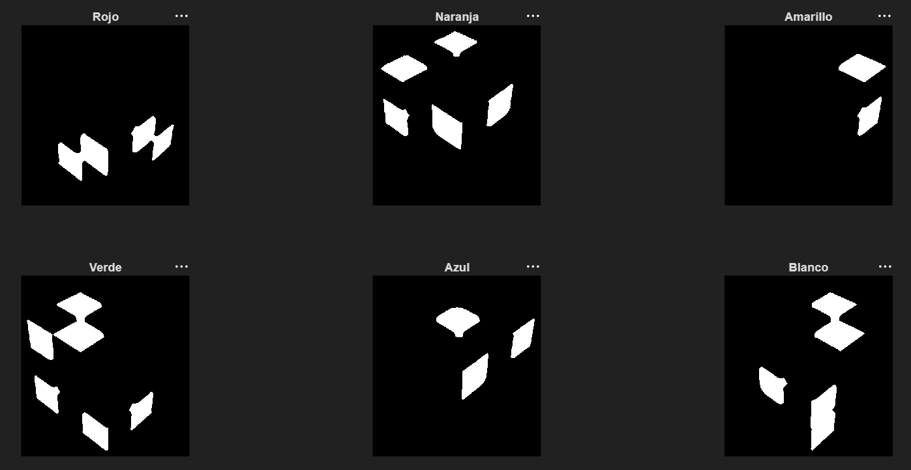
</p>

---

### Fase 5: Extracción geométrica de candidatos y clasificación de color

En esta fase se generan exactamente **27 candidatos por imagen**, correspondientes a las tres caras visibles del cubo y sus nueve stickers por cara.

El método final usa un enfoque geométrico:

1. Detección de bordes con Canny.
2. Estimación de líneas con Hough.
3. Estimación de polígonos de las caras visibles.
4. Rectificación proyectiva de cada cara.
5. División de cada cara rectificada en una grilla 3x3.
6. Muestreo central de cada celda.
7. Clasificación por K-means usando características de color.

Técnicas usadas:

- Canny.
- Transformada de Hough.
- Transformación proyectiva.
- Muestreo de parches centrales.
- K-means de MATLAB.
- Características HSV/RGB promedio.

<p align="center">
  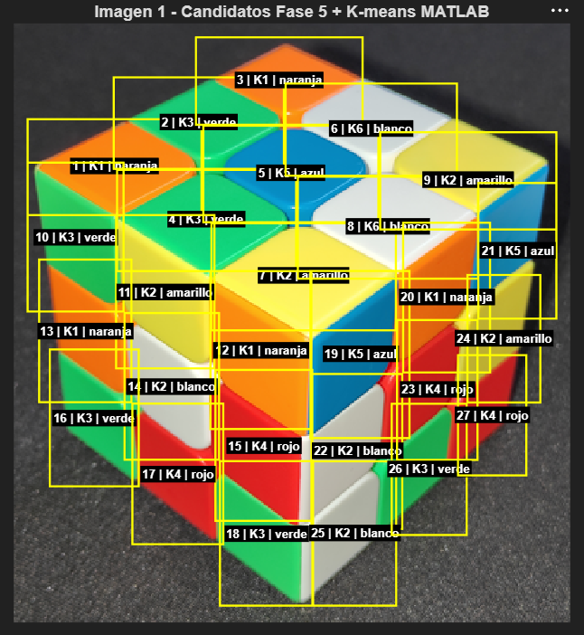
</p>

---

### Fase 6: Agrupación por caras visibles

Los 27 candidatos de cada imagen se agrupan en tres caras visibles:

- Cara superior.
- Cara izquierda.
- Cara derecha.

Cada cara debe contener exactamente 9 stickers. La asignación se hace usando los polígonos estimados y la geometría de la grilla, no solo por agrupamiento espacial.

<p align="center">
  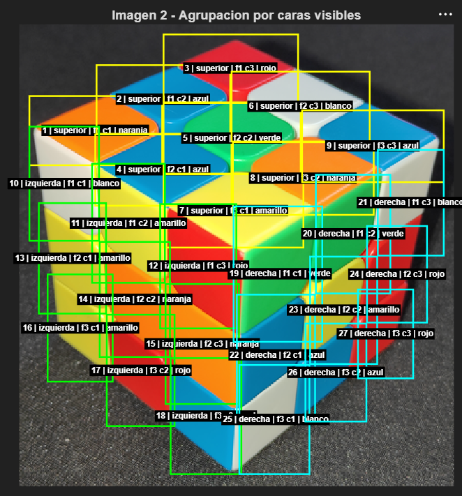
</p>

---

### Fase 7: Matrices 3x3 por cara

Con la información de cara, fila, columna y color clasificado, se construye una matriz 3x3 para cada cara visible en cada imagen.

Ejemplo conceptual:

```text
Cara superior:
[ N  V  N ]
[ V  Az B ]
[ A  B  A ]
```

<p align="center">
  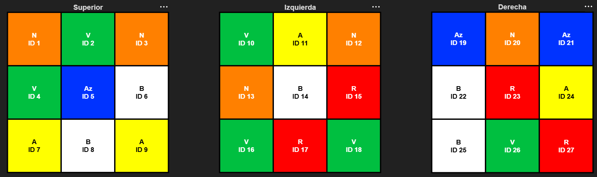
</p>

---

### Fase 8: Integración de las seis caras

Las seis caras del cubo se integran usando el color central de cada matriz 3x3. La regla aplicada es:

```text
El color del sticker central define el nombre real de la cara.
```

Por ejemplo:

- Centro blanco → cara blanca.
- Centro rojo → cara roja.
- Centro azul → cara azul.

Esta fase evita depender de una posición fija de la cámara, ya que identifica cada cara por su centro.

<p align="center">
  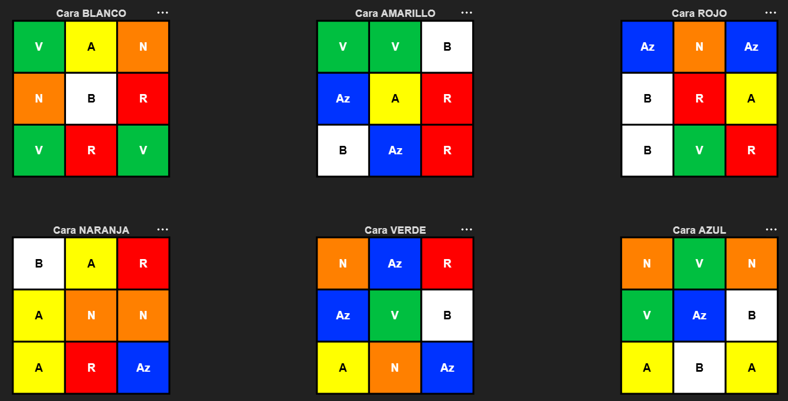
</p>

---

### Fase 9: Evaluación cuantitativa

El cubo integrado se compara contra el archivo `ground_truth_cubo.csv` de cada caso. La comparación se realiza por:

```text
cara + fila + columna
```

Métricas calculadas:

- Accuracy global.
- Correctos e incorrectos.
- Matriz de confusión.
- Precisión por color.
- Recall por color.
- F1-score por color.

<p align="center">
  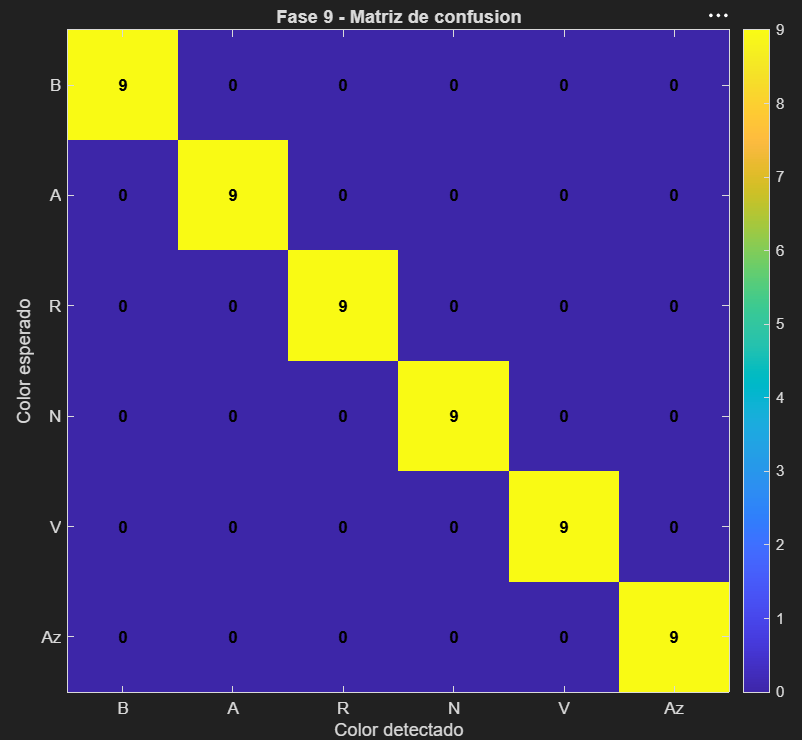
</p>

---

### Fase 10: Reporte individual

Genera un reporte por caso con las matrices reconstruidas, métricas de evaluación y diagnóstico general del pipeline.

---

### Fase 11: Prueba masiva

Ejecuta el pipeline completo sobre todos los casos del dataset. Para cada caso registra:

- Estado de ejecución.
- Accuracy global.
- Total de stickers evaluados.
- Correctos e incorrectos.
- Tiempo de procesamiento.
- Ruta de resultados.

<p align="center">
  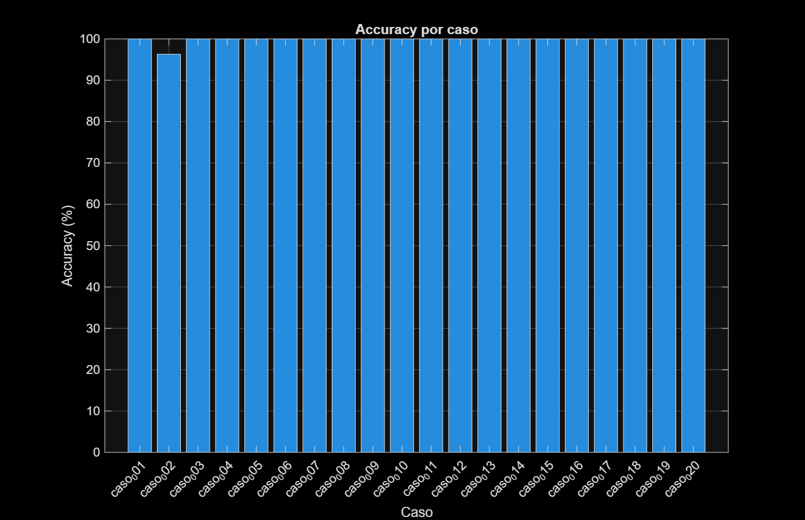
</p>

---

### Fase 12: Resultados globales del dataset

Consolida todos los resultados generados por la prueba masiva. Esta fase produce:

- Matriz de confusión global.
- Métricas globales por color.
- Tabla global de errores.
- Resumen global del dataset.
- Gráficos listos para presentación.

<p align="center">
  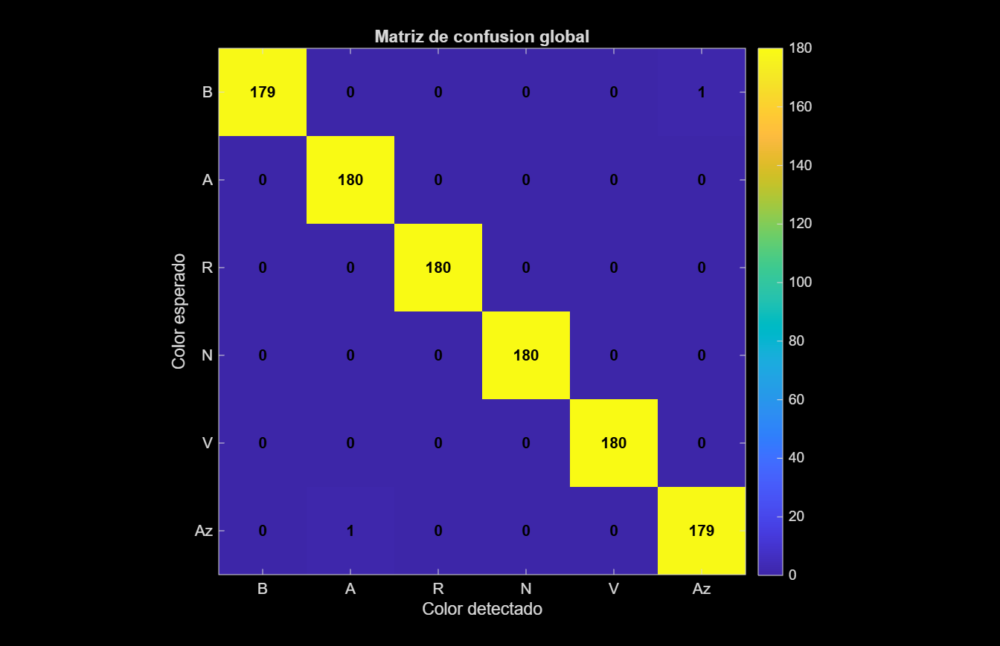
</p>

<p align="center">
  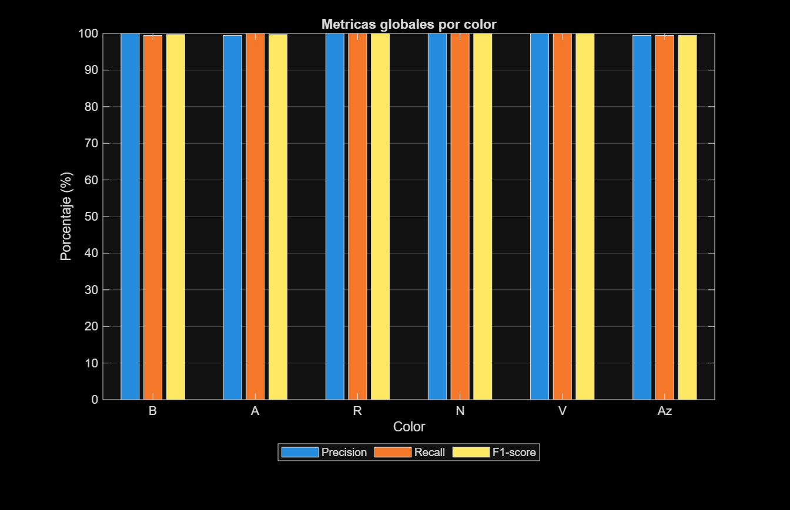
</p>

---

## 6. Dataset

El dataset está organizado por casos. Cada caso contiene dos imágenes y un archivo de verdad terreno.

```text
dataset/
├── caso_001/
│   ├── img1.png
│   ├── img2.png
│   └── ground_truth_cubo.csv
├── caso_002/
│   ├── img1.png
│   ├── img2.png
│   └── ground_truth_cubo.csv
└── ...
```

El archivo `ground_truth_cubo.csv` debe tener el siguiente formato:

```csv
cara,fila,columna,color
blanco,1,1,V
blanco,1,2,A
blanco,1,3,Az
blanco,2,1,N
...
```

Códigos de color usados:

| Código | Color |
|---|---|
| B | Blanco |
| A | Amarillo |
| R | Rojo |
| N | Naranja |
| V | Verde |
| Az | Azul |

---

## 7. Cómo ejecutar el proyecto

### Ejecutar un caso individual

En `config_rubik.m`, configurar el caso deseado:

```matlab
cfg.caso_actual = 'caso_001';
```

Luego ejecutar:

```matlab
main_rubik
```

---

### Ejecutar la prueba masiva

En `config_rubik.m`, configurar el rango de casos:

```matlab
cfg.casos_masivos = arrayfun(@(k) sprintf('caso_%03d', k), ...
    1:20, ...
    'UniformOutput', false);
```

Luego ejecutar:

```matlab
main_prueba_masiva
```

---

### Generar resultados globales

Después de ejecutar la prueba masiva:

```matlab
main_fase12_resultados
```

---

## 8. Resultados de un caso individual

Para el caso individual evaluado, el sistema logró reconstruir las seis caras del cubo e integrar las matrices 3x3 usando el color central de cada cara.

Ejemplo de cubo integrado:

<p align="center">
  
</p>

En un caso con reconstrucción perfecta, la matriz de confusión individual presenta una diagonal completa:

<p align="center">
  
</p>

---

## 9. Resultados globales

La prueba masiva se realizó con **20 casos**, cada uno compuesto por dos imágenes. En total se evaluaron **1080 stickers**.

| Métrica | Resultado |
|---|---:|
| Casos evaluados | 20 |
| Casos procesados correctamente | 20 |
| Casos fallidos | 0 |
| Stickers evaluados | 1080 |
| Stickers correctos | 1078 |
| Stickers incorrectos | 2 |
| Accuracy global del dataset | 99.815 % |
| Accuracy promedio | 99.815 % |
| Accuracy mínima | 96.296 % |
| Accuracy máxima | 100.000 % |
| Desviación del accuracy | 0.00828 |
| Tiempo total aproximado | 14.545 s |
| Tiempo promedio por caso | 0.727 s |

<p align="center">
  
</p>

---

## 10. Matriz de confusión global

Cada color aparece 180 veces en el dataset, debido a que se evaluaron 20 casos y cada cubo tiene 9 stickers por color.

La matriz de confusión global concentra los resultados de los 1080 stickers evaluados.

<p align="center">
  
</p>

Interpretación general:

- La mayor parte de los valores se concentra en la diagonal principal.
- Los errores fuera de la diagonal son mínimos.
- El rendimiento global fue de 1078 aciertos sobre 1080 stickers.
- No se observaron fallas estructurales en la detección del cubo ni en la integración de caras.

---

## 11. Métricas globales por color

Las métricas por color muestran precisión, recall y F1-score para cada clase cromática.

<p align="center">
  
</p>

Interpretación:

- Rojo, naranja y verde alcanzaron rendimiento perfecto en el dataset evaluado.
- Blanco, amarillo y azul presentaron ligeras variaciones por errores puntuales.
- Todas las clases mantienen un desempeño superior al 99 %.
- El clasificador no evidencia sesgo grave hacia un color específico.

---

## 12. Técnicas principales aplicadas

| Etapa | Técnicas usadas |
|---|---|
| Análisis de color | RGB, HSV, histogramas |
| Preprocesamiento | Filtro gaussiano, filtro de mediana |
| Segmentación | Umbralización, máscaras HSV |
| Morfología | `bwareaopen`, `imclose`, `imfill`, `bwareafilt` |
| Extracción geométrica | Canny, Hough, polígonos de caras |
| Corrección de perspectiva | Transformación proyectiva |
| Detección de stickers | Grilla geométrica 3x3 por cara |
| Clasificación | K-means y características HSV/RGB |
| Evaluación | Accuracy, precisión, recall, F1-score, matriz de confusión |

---

## 13. Conclusiones

1. El pipeline desarrollado permitió reconstruir la configuración completa del cubo de Rubik usando dos imágenes por caso.
2. La detección automática de esquinas mediante Canny y Hough permitió reducir la intervención manual y hacer viable la prueba masiva.
3. La rectificación proyectiva de cada cara facilitó ordenar los stickers como matrices 3x3.
4. El uso del color central permitió integrar las seis caras sin depender de una posición fija de cámara.
5. La evaluación masiva sobre 20 casos alcanzó una exactitud global de **99.815 %**, con **1078 aciertos de 1080 stickers**.
6. El sistema no presentó fallos de ejecución en el dataset evaluado.
7. Los errores residuales fueron puntuales y no afectaron la estabilidad general del método.

---

## 14. Limitaciones

- El método requiere que en cada imagen se observen claramente tres caras del cubo.
- La calidad de la detección puede disminuir si hay reflejos fuertes, baja iluminación o fondo poco contrastante.
- El ground truth debe estar correctamente anotado con la misma orientación usada por el pipeline.
- La clasificación puede confundirse en zonas donde el muestreo central cae cerca de bordes, sombras o stickers vecinos.

---

## 15. Trabajo futuro

- Aumentar el dataset con más casos y condiciones de iluminación.
- Probar fondos más variados.
- Implementar validaciones adicionales sobre la consistencia física del cubo.
- Mejorar el muestreo de color usando múltiples puntos por sticker.
- Comparar K-means con clasificadores supervisados.
- Exportar la configuración final a un formato compatible con solucionadores de cubo de Rubik.

---

## 16. Requisitos

- MATLAB.
- Image Processing Toolbox.
- Statistics and Machine Learning Toolbox para `kmeans`.

---

## 17. Autoría

Proyecto académico desarrollado para el curso de Procesamiento de Imágenes Digitales.

